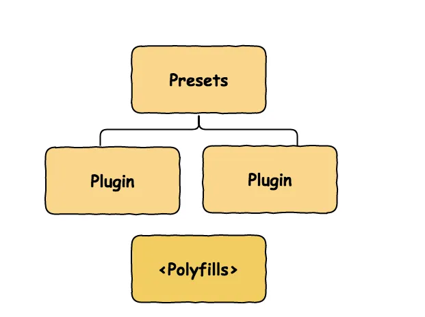

# Asset Building Using Webpack & Babel

# Webpack

## Video: [Webpack crash course | easy way](https://www.youtube.com/watch?v=yiwSVeHYosQ&t=12s)
1. In this video we will be giving you instructions to build webpack rather than the starter.
2. So what problem does webpack solves ?
    - If you are using `AJAX` then, you might have faced error because, you have called your `js` before you called the `jQuery library`.
    - Imagine 100s of file which needs to be loaded into specific file in specific dependancy order, it would be nighmare if you try to do manually, so here comes the webpack.
    - Webpack allows you to push all the code into one file, and that file is going to do everything, I don't need to worry when to load the modules.
    - We do get a **config** file, where you can define how few things happen.
    - You also need to have some knowledge of loaders and plugin.


**Getting Started**
1. Create a node project with command `npm init -y`  (`-y` flag so you don't need to answer every question)
2. To configure the webpack, first install webpack using the command, and also the webpack cli `npm i webpack webpack-cli --save-dev`
3. Create a file called `webpack.config.js` (Actually you can have different names, but it will be tideous to setup so use this.).
    ```js
    module.exports = {

    };
    ```
    This is all you need
4. This will mostly have some key value pairs, so let's have an entry as an `./app/index.js`
5. Let's say your project is going to include some stylesheets, some svg then let's add the `svg-inline-loader`
6. Let's find a similar package to the above one for css.
7. You can see they sometimes use `loader` sometimes use `use` keyword, so both are same, but we recommend using the keyword **`use`**

    ```js
    const path = require( "path" );
    const HtmlWebpackPlugin = require('html-webpack-plugin');

    module.exports = {
        entry: "./app/index.js",
        module: {
            rules: [
                // Loading SVG
                {
                    // This line tells to find any file matching with .svg extention
                    test: /\.svg$/,
                    loader: "svg-inline-loader"
                },
                // Loading CSS
                {
                    test: /\.css$/i,
                    // They are loaded from right to left, so first the `css-loader` will be loader
                    use: ["style-loader", "css-loader"],
                },
                // Loading JS
                {
                    test: /\.(js)$/i,
                    use: "babel-loader"
                }
            ]
        },
        output: {
            path: path.resolve( __dirname, "dist" ),
            filename: "bundle.js"
        },
        plugins: [
            new HtmlWebpackPlugin()
        ],
        mode: process.env.NODE_ENV === "production" ? "production" : "development"
    };
    ```

**Footnotes**
1. So you can see there's a lot of `--save-dev` or `-D` flag with the npm command, so the reason is there might be some dependancies which are just there for let's say in the development environment, like testing libraries.
    - To install these dev dependancies we use the flag.
2. **Loaders**:
    - Job of the loaders is like mostly loading the files before we generate the final output.
3. **Plugins**
    - What to do with those file to generate the output is handled by these plugins. Like adding the bundle.js to your index.html

**References**
- [https://webpack.js.org](https://webpack.js.org)
- [https://www.npmjs.com](https://www.npmjs.com)
- [npm/svg-inline-loader](https://www.npmjs.com/package/svg-inline-loader)
- [npm/css-loader](https://www.npmjs.com/package/css-loader)
- [npm/html-webpack-plugin](https://www.npmjs.com/package/html-webpack-plugin)

## Documentation: [Concepts](https://webpack.js.org/concepts)
1. Webpack is a **static module bundler** for modern javascript.
2. When webpack processes the your application, it builds a dependancy graph from one or more entry points, and combines them into one ore more bundles. 

Let's see some core concepts
### Entry
1. An entry point indicates which module webpack should use to begin building out its internal dependency graph.
2. By default its value is `./src/index.js`

    ```js
    module.exports = {
    entry: './path/to/my/entry/file.js',
    };
    ```

### Output
1. The output property tells webpack where to emit the bundles it creates and how to name these files. 
2. Defaults to `./dist/main.js`

    ```js
    const path = require('path');

    module.exports = {
    entry: './path/to/my/entry/file.js',
    output: {
        path: path.resolve(__dirname, 'dist'),
        filename: 'my-first-webpack.bundle.js',
    },
    };
    ```

### Loaders
1.  Loaders allow webpack to process other types of files and convert them into valid modules that can be consumed by your application and added to the dependency graph.
2. At a high level, loaders have two properties in your webpack configuration:
    - The `test` property identifies which file or files should be transformed.
    - The `use` property indicates which loader should be used to do the transforming.

    ```js
    const path = require('path');

    module.exports = {
    output: {
        filename: 'my-first-webpack.bundle.js',
    },
    module: {
        rules: [{ test: /\.txt$/, use: 'raw-loader' }],
    },
    };
    ```

### Plugins
1. Plugins can be leveraged to perform a wider range of tasks like bundle optimization, asset management and injection of environment variables.
    ```js
    const HtmlWebpackPlugin = require('html-webpack-plugin');
    const webpack = require('webpack'); //to access built-in plugins

    module.exports = {
    module: {
        rules: [{ test: /\.txt$/, use: 'raw-loader' }],
    },
    plugins: [new HtmlWebpackPlugin({ template: './src/index.html' })],
    };
    ```

### Mode
1. By setting the mode parameter to either `development`, `production` or `none`, you can enable webpack's built-in optimizations that correspond to each environment. 
2. The default value is `production`.
    ```js
    module.exports = {
    mode: 'production',
    };
    ```

### Browser Compatibility
1. Webpack supports all browsers that are **ES5-compliant** (IE8 and below are not supported). 
2. Webpack needs Promise for `import()` and `require.ensure()`. If you want to support older browsers, you will need to load a polyfill before using these expressions.

### Environment
Webpack 5 runs on Node.js version 10.13.0+.

## Article: [Webpack - Behind the Scenes](https://imranhsayed.medium.com/webpack-behind-the-scenes-85333a23c0f6)


**Short Summury**
1. The compiler is the starting point, controls how the webpack starts/stops or emits.
2. The compiler then creates Compilation. Compilation is the heart of Webpack, where webpack kicks off building the graph, ceiling it and rendering it into bundles.
3. Resolver — When you pass your entry point to webpack , it gives it to the Resolver, which checks if a given partial path exits, and return the full absolute path along with extra info like context, request, calls etc. 
4. Module factories then take a successfully resolved request from the resolver, collects the source code from that file and create a module object/instance
5. A parser takes a string of source code and converts it into AST( Abstract Syntax Tree ) Webpack traverses through entire AST. It also finds all the require and import from AST statements and creates a dependency graph.
6. Templates will then do the data binding for your parsed module objects and generate the code that you see in the bundled javascript file. 
7. Tree shaking or Live Code inclusion means that webpack uses the syntax statically to identify, what is being used and bundles only that.

# Babel
Babel is a JavaScript **compiler**. Babel transpiles/converts ( #transpiler ) modern JavaScript ( ECMAScript 2015+ ) code into a *backward compatible version of JavaScript* in current and older browsers or environments.


### Plugins
1. Babel runs in 3 stages
    - Parsing
    - Transform
    - Printing
2. Basically, for babel to do anything you need to add plugin else it will basically parse that and write the same code.
3. Babel is built on plugins which translates the moder js into an AST, and rewrites into backword compatible versions of JS.
    - The plugins are small JS programs.

### Presets
1. Instead of adding all the plugins we want one by one, we can use a “preset” which is just a pre-determined set of plugins.
2. Common ones are:
    - @babel/preset-env
    - @babel/preset-flow
    - @babel/preset-react ( for React and it supports JSX Syntax )
    - @babel/preset-typescript

#### @babel/preset-env
Without any configuration, this preset will include all plugins to support modern JavaScript (ES2015, ES2016, etc.)

#### Why use @babel/preset-env?
The most popular preset is @babel/preset-env because it helps us specify what level of compatibility you need for the targets you intend to support and babel will automatically install the appropriate transformation plugin


### Configuration
There are two ways we can do the configuration:

1. **babel.config.js** ( Project-wide configuration ): You can use it if you want to programmatically create configuration or if you want to compile node modules.
```js
/**
babel.config.js with useful plugins. 
*/
module.exports = function(api) {
    api.cache(true);
    api.assertVersion("^7.4.5");

    const presets = [
                    [
                      "@babel/preset-env", {
                        "targets": {
                          "esmodules": true,
                          "node":true
                        }
                      }
                    ]
                ];
    const plugins = [
        ['@babel/plugin-transform-modules-commonjs'],
        ['@babel/plugin-transform-destructuring'],
        ['@babel/plugin-proposal-class-properties'],
        ['@babel/plugin-proposal-decorators',{
        'decoratorsBeforeExport':true
        }],
        ['@babel/plugin-proposal-export-default-from'],
        ['@babel/plugin-proposal-export-namespace-from'],
        ['@babel/plugin-proposal-object-rest-spread'],
        ['@babel/plugin-transform-template-literals'],
        ['@babel/plugin-proposal-pipeline-operator',{"proposal":"minimal"}],
        ['@babel/plugin-transform-runtime'],
        ['@babel/plugin-transform-classes']
    ];

    return {
        presets,
        plugins
    }
}
```

2. .babelrc ( File-relative configuration ): If you have a static configuration that only applies to a single package ) https://babeljs.io/docs/en/config-files#file-relative-configuration


```js
//.babelrc
{
  "presets": [
 [
   "@babel/preset-env",
   {
  "targets": {
    "browsers": [ "last 2 versions" ]
  },
  // Madule: false means Hey babel don't do anything with the module let babel handle it.
  "modules": false
   }
 ]
  ]
  "plugins": []
}
```

- Plugins run before Presets.
- Plugin order is first to last.
- Preset ordering is reversed (last to first).

### Polyfills
1. A polyfill is code that implements a feature on web browsers that do not support the feature.
2. In order for certain features to work they require certain polyfills. You can satisfy all Babel feature requirements by using @babel/polyfill.
3. There are two parts in Babel:
    - Transpile the code
    - Polyfill.


#### @babel/polyfill
1. Since Babel assumes that your code will run in an ES5 environment it uses ES5 functions.
2. So if you’re using an environment that has limited or no support for ES5 such as lower versions of IE then using @babel/polyfill will add support for these methods. 


There are two ways to configure the `@babel/polyfill`

1. Add `“useBuiltIns”`: `“usage”` to your babel configuration file( .babelrc ).
```bash
{
  "presets": [
   [ "@babel/preset-env", {
     "modules": false,
     "targets": {
      "browsers": [
        "last 2 Chrome versions",
        "last 2 Firefox versions",
        "last 2 Safari versions",
        "last 2 iOS versions",
        "last 1 Android version",
        "last 1 ChromeAndroid version",
        "ie 11"
      ]
     },
     "useBuiltIns": "usage"
   } ]
  ]
}
```
2. Or, add this to your `webpack.config.js` file
```js
entry: ["@babel/polyfill", "./src/index.js"],
```
