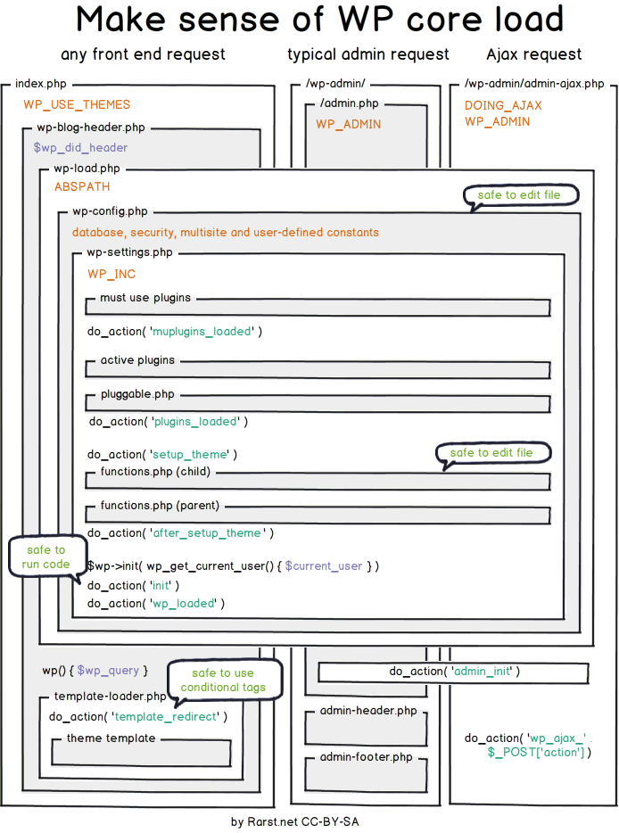

# How WordPress Works



# The Journey Of A Request

##  `index.php`
- As soon as your request hits the server it loads the index.php file.
- This file first defines a constant called `WP_USES_THEME` which defines whether to show the UI or not, it will be later used inside `template-loader.php` file. If set to `FALSE` it won't display the UI. Efficient in the case of REST API right. [Read](https://wordpress.stackexchange.com/questions/12919/what-is-the-constant-wp-use-themes-for)
- And it loads the `wp-blog-header.php` file.

## `wp-blog-header.php`
- This one first checks if the headers are already sent or not using the variable `$wp_did_header` variable.
- Then it loads the `wp-load.php`

## `wp-load.php`
- This file will first define the `ABSPATH` and later it will load the `wp-config.php` file which defines all the constants like the DB constants.
- One of the important files which it loads is `wp-settings.php`
- This will first load all the necessary files in the `WPINC` directory `define( 'WPINC', 'wp-includes' );`
- A lot of things happen but, we will focus on the most important things for us
### MU Plugin Loading
1. The MU Plugin paths are stored under `wp_plugin_paths` global.
2. `wp_get_mu_plugins()` is called to get all the MU plugins.
	1. This function basically scans through the MU Plugin directory for any file which ends with `.php` extension.
3. Once we get those paths, then we use `include_once $mu_plugin_file` to include all those files.
4. After each file is loaded it runs the action `mu_plugin_loaded`

```php
/**
* Fires once a single must-use plugin has loaded.
*
* @since 5.1.0
*
* @param string $mu_plugin Full path to the plugin's main file.
*/
do_action( 'mu_plugin_loaded', $mu_plugin );
```
### Plugin Loading
1. First it loads the network plugin in the case of **multisite** setup, else directly loads the normal plugins.
2. It finds all the active and valid plugins using the function `wp_get_active_and_valid_plugins()`
	1. It gets all the active plugins using `get_option( 'active_plugins' );`
	2. Then just generates the paths to the plugin root files using this 
	
		```php
		WP_PLUGIN_DIR . '/' . $plugin;	
		```

3. The plugins are loaded again similarly using the `include_once` statement.

```php
/**
* Fires once activated plugins have loaded.
*
* Pluggable functions are also available at this point in the loading order.
*
* @since 1.5.0
*/
do_action( 'plugins_loaded' );
```

### WP Query get's initialised

```php
/**
* WordPress Query object
*
* @since 2.0.0
*
* @global WP_Query $wp_the_query WordPress Query object.
*/
$GLOBALS['wp_the_query'] = new WP_Query();

/**
* Holds the reference to {@see $wp_the_query}.
* Use this global for WordPress queries
*
* @since 1.5.0
*
* @global WP_Query $wp_query WordPress Query object.
*/
$GLOBALS['wp_query'] = $GLOBALS['wp_the_query'];

/**
* Holds the WordPress Rewrite object for creating pretty URLs
*
* @since 1.5.0
*
* @global WP_Rewrite $wp_rewrite WordPress rewrite component.
*/
$GLOBALS['wp_rewrite'] = new WP_Rewrite();

/**
* WordPress Object
*
* @since 2.0.0
*
* @global WP $wp Current WordPress environment instance.
*/
$GLOBALS['wp'] = new WP();

/**
* WordPress Widget Factory Object
*
* @since 2.8.0
*
* @global WP_Widget_Factory $wp_widget_factory
*/
$GLOBALS['wp_widget_factory'] = new WP_Widget_Factory();

/**
* WordPress User Roles
*
* @since 2.0.0
*
* @global WP_Roles $wp_roles WordPress role management object.
*/
$GLOBALS['wp_roles'] = new WP_Roles();

/**
* Fires before the theme is loaded.
*
* @since 2.6.0
*/
do_action( 'setup_theme' );
```

