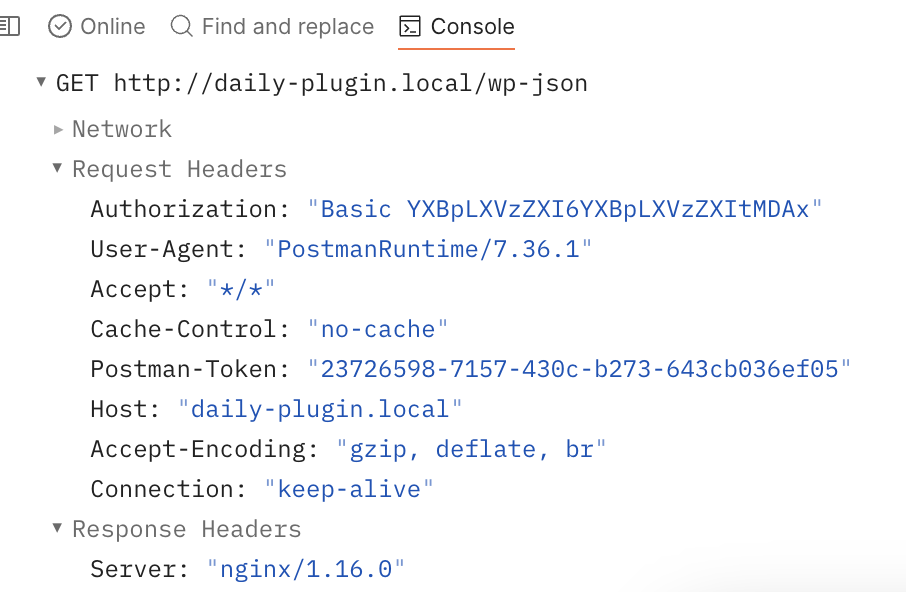

# REST API Introduction
The WordPress REST API provides an interface for applications to interact with your WordPress site by sending and receiving data as JSON.

The REST API is a developer-oriented feature of WordPress. It provides data access to the content of your site and implements the same authentication restrictions

## What is REST API ?
An API is an Application Programming Interface. REST, stands for “Representational State Transfer,” is a set of concepts for modelling and accessing your application’s data as interrelated objects and collections.

# Using REST API

## Key Concepts
### Routes
In the context of the WordPress REST API a route is a URI which can be mapped to different HTTP methods. The mapping of an individual HTTP method to a route is known as an endpoint.

### Request
A REST API request is represented within WordPress by an instance of the **`WP_REST_Request`** class, which is used to store and retrieve information for the current request.

### Response
Responses are the data you get back from the API. The **`WP_REST_Response`** class provides a way to interact with the response data returned by endpoints.

### Schema
The schema structures API data and provides a comprehensive list of all of the properties the API can return and which input parameters it can accept. 

### Controller
With a controller class you can manage the registration of routes & endpoints, handle requests, utilize schema, and generate API responses.

## Authentication
### Cookie Authentication
1. When you log in to your dashboard, this sets up the cookies correctly for you, so plugin and theme developers need only to have a logged-in user.
2. If you are going to make any Ajax request, remember to add `_wpnonce` parameter in body or `X-WP-Nonce` in the header parameter
    - If no nonce is provided user is set to 0 and request becomes **unauthenticated**.

### Basic Authentication with Application Passwords
1. From WP 5.6 it's shipped with **Application Passwords**, they can be generated in `wp-admin -> Users -> Edit User`
    ```bash
    curl --user "USERNAME:PASSWORD" https://HOSTNAME/wp-json/wp/v2/users?context=edit
    ```
2. Here's how the request looks
    

    - As you can see the **Authorization** header contains the value, it's the Base
    - This basic method sends a *base 64* encoded string along with the request, so it should be avoided for HTTP transport.

3. If you would rather have curl first test if the authentication is really required, you can ask curl to figure that out and then automatically use the most safe method it knows about with `--anyauth`. This makes curl try the request unauthenticated, and then switch over to authentication if necessary:

    ```bash
    curl --anyauth --user daniel:secret http://example.com/
    ```

### Authentication Plugins
Plugins may be added to support alternative modes of authentication that will work from remote applications. Some example plugins are [OAuth 1.0a Server](https://wordpress.org/plugins/rest-api-oauth1/) and [JSON Web Tokens](https://wordpress.org/plugins/jwt-authentication-for-wp-rest-api/).

## Discovery
The first step of connecting to a site is finding out whether the site has the API enabled.

### Discovering the API
1. The preferred way to handle discovery is to send a HEAD request to the supplied address.
2. Visit `https://{site-name}/wp-json/`

## Global Parameters
The API includes a number of global parameters (also called “meta-parameters”) which control how the API handles the request/response handling.

### \_fields
To instruct WordPress to return only a subset of the fields in a response, you may use the `_fields` query parameter.

```curl
/wp/v2/posts?_fields=author,id,excerpt,title,link
```

### \_embed
To reduce the number of HTTP requests required, clients may wish to fetch a resource as well as the linked resources.

*Example*, `/wp/v2/posts?_embed=author,wp:term` will only embed the post’s author and the lists of terms associated with the post.

### \_method
Some servers and clients cannot correctly process some HTTP methods that the API makes use of.
*Example*, A `POST` to `/wp-json/wp/v2/posts/42?_method=DELETE` would be translated to a `DELETE` to the `wp/v2/posts/42` route.

### \_envolope
The API supports passing an `_envelope` parameter, which sends all response data in the body, including headers and status code.

### \_jsonp
The API natively supports [JSONP](https://en.wikipedia.org/wiki/JSONP) responses to allow cross-domain requests for legacy browsers and clients.

```html
<script>
function receiveData( data ) {
  // Do something with the data here.
  // For demonstration purposes, we'll simply log it.
  console.log( data );
}
</script>
<script src="https://example.com/wp-json/?_jsonp=receiveData"></script>
```

## Linking & Embeding
### \_links
The `_links` property of the response object contains a map of links to other API resources, grouped by “relation.”

```js
{
  "id": 42,
  "_links": {
    "collection": [
      {
        "href": "https://example.com/wp-json/wp/v2/posts"
      }
    ],
    "author": [
      {
        "href": "https://example.com/wp-json/wp/v2/users/1",
        "embeddable": true
      }
    ]
  }
}
```
### \_embeded
Embedding is triggered by setting the [`_embed` query parameter](https://developer.wordpress.org/rest-api/using-the-rest-api/global-parameters/#_embed) on the request. This will then include embedded resources under the `_embedded` key adjacent to the `_links` key.

```js
{
  "id": 42,
  "_links": {
    "collection": [
      {
        "href": "https://example.com/wp-json/wp/v2/posts"
      }
    ],
    "author": [
      {
        "href": "https://example.com/wp-json/wp/v2/users/1",
        "embeddable": true
      }
    ]
  },
  "_embedded": {
    "author": {
      "id": 1,
      "name": "admin",
      "description": "Site administrator"
    }
  }
}
```

## Pagination
### Pagination Parameters
- `?page=`: specify the page of results to return.
    - For example, `/wp/v2/posts?page=2` is the second page of posts results
    - By retrieving `/wp/v2/posts`, then `/wp/v2/posts?page=2`, and so on, you may access every available post through the API, one page at a time.
- `?per_page=`: specify the number of records to return in one request, specified as an integer from 1 to 100.
    - For example, `/wp/v2/posts?per_page=1` will return only the first post in the collection
- `?offset=`: specify an arbitrary offset at which to start retrieving posts
    - For example, `/wp/v2/posts?offset=6` will use the default number of posts per page, but start at the 6th post in the collection
    - `?per_page=5&page=4` is equivalent to `?per_page=5&offset=15`

To determine how many pages of data are available, the API returns two header fields with every paginated response:

- `X-WP-Total`: the total number of records in the collection
- `X-WP-TotalPages`: the total number of pages encompassing all available records

### Ordering Results
In addition to the pagination query parameters detailed above, several other parameters control the order of the returned results:

- `?order=`: control whether results are returned in ascending or descending order
    - Valid values are `?order=asc` (for ascending order) and `?order=desc` (for descending order).
    - All native collections are returned in descending order by default.
- `?orderby=`: control the field by which the collection is sorted
    - The valid values for `orderby` will vary depending on the queried resource; for the `/wp/v2/posts` collection, the valid values are “date,” “relevance,” “id,” “include,” “title,” and “slug”

# REST API Codebase Overview
## [Codebase Overview Pt 1](https://www.youtube.com/watch?v=NiCb8amOnxU)
1. So we are exploring the `wp-includes\rest-api.php` file.
2. This contains functions like `register_rest_route()`, `register_rest_field()` etc.
3. The `rest_api_init()` function gets executed, and add the rewrite rules.
	1. There's a function called `rest_get_url_prefix()` this will return the prefix, the default is `wp-json`. And if you want to update the prefix then just use the filter `rest_url_prefix` to update it.
	2. BTW, the rewrite rules are added so that later the requests can be resolved.
4. Then it calls the `create_initial_rest_routes()`