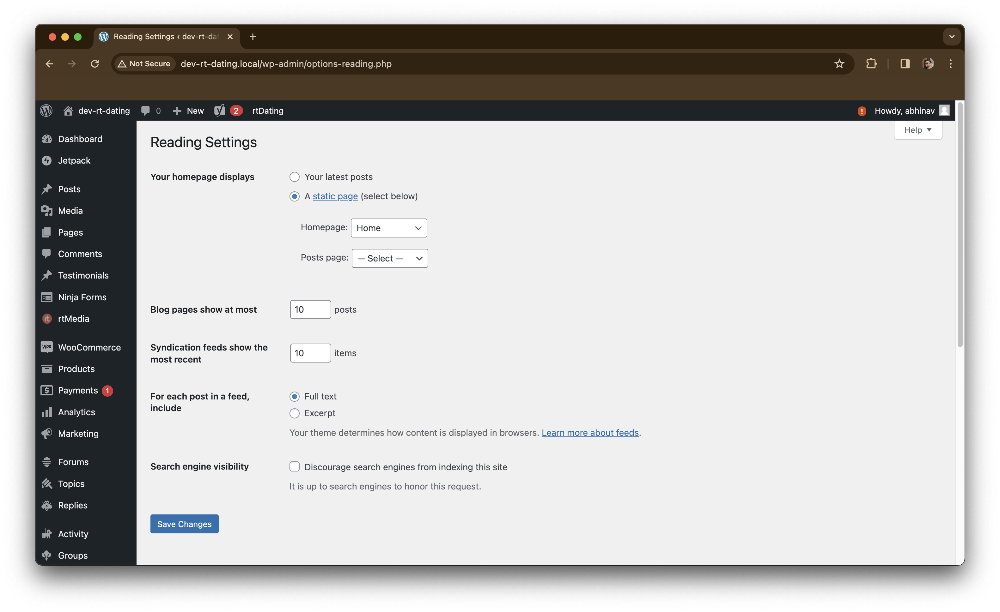
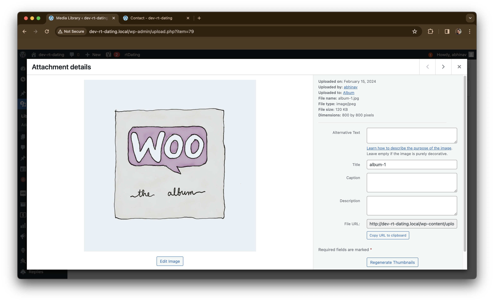

# How can we hide those panels?
1. Go to `Users > All Users`, select the profile
2. In the toolbar option **check** `Select Toolbar when viewing site` option.

# Is it possible to copy a block and paste it on another page?
1. **Yes**, we can simply copy paste using macOS or any OS operation
2. Using `cmd + c` and `cmd + v` to paste the block.

# How can we change site language?
1. Go to `Settings > General`
2. Go to `site langugae` and select the desired language

# What are the different reading settings?

1. **Your homepage displays**: What homepage displays
2. **Syndication feeds show the most recent**: 
3. **For each post in a feed, include**: 
4. **Search engine visibility**: You can `block/unblock`, Discourage search engines from indexing this site

# What are the different media settings?

1. Alternative Text - Alt text if image not loaded
2. Title - image title
3. Captions - image captions for accesibility
4. Descriptions - image description
5. File URL - File URL