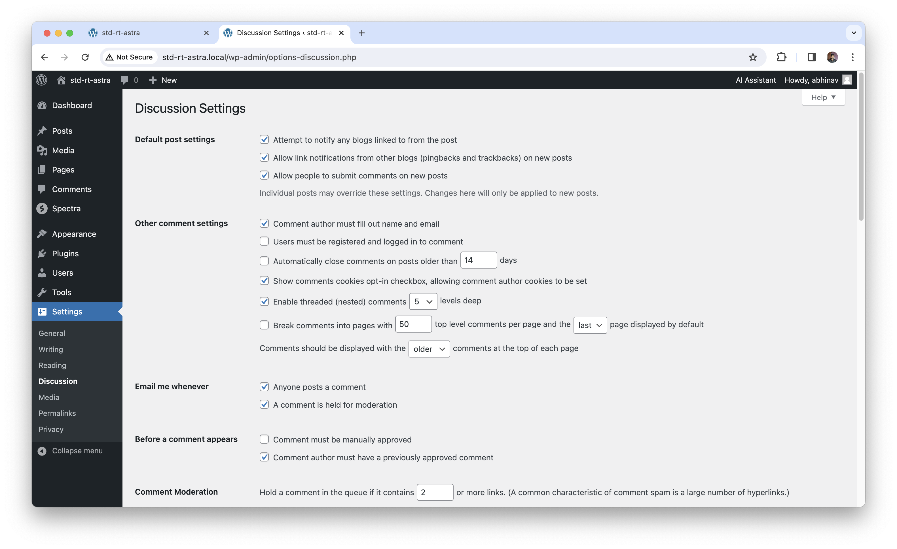

# What are the different discussion settings?

1. **Default Post Settings**
    - These settings features options to notify blog links
    - Allowing people to submit new posts
2. **Other Comment Settings**
    - options such as compulsory filling comment author name, email
    - automatically closing comments withing a given period (days)
    - Breaking comments in pages
3. **Email Me Whatever**
    - Options for letting anyone post the comment
    - Either to held a comment for moderation or not
4. **Comment Moderation**
5. **Disallowed Comment Keys**
6. **Avatar Settings**

# What is the difference between the WordPress address (URL) and the Site address (URL)?
- The **WordPress address (URL)** refers to the **location of the WordPress core files** on the server. This setting is used to access the WordPress admin dashboard and perform administrative tasks.
- **The Site address (URL) refers to the front-end URL** of your WordPress site, where visitors can access your site's content. This setting determines the URL displayed in the browser's address bar when someone visits your site.

# What is a 'tagline' of a WordPress site? How do you change it?
- A tagline is a **brief description or slogan** that accompanies your site's title. It provides additional context or information about your site's purpose or content.
- You can change the tagline of your WordPress site by navigating to the WordPress admin dashboard and clicking on `Settings > General`." In the General Settings page, you'll see an option to edit the Site Title and Tagline.

# How do you set the 'site icon' in WordPress? What is the preferred size?
- The site icon, also known as a **favicon**, is a small image that represents your website and appears in the browser's address bar, browser tabs, and bookmarks.
- To set the site icon in WordPress, go to the WordPress admin dashboard and navigate to `Appearance > Customize` In the Customizer, you'll find an option to upload or select a site icon. The preferred size for a site icon is typically **512x512** pixels, and WordPress will automatically generate smaller sizes as needed for different devices and displays.