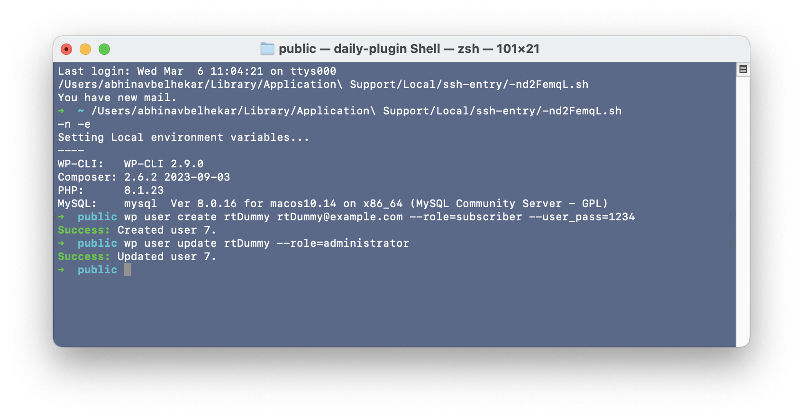

**1. How can you use WP CLI to: create a new user rtDummy with subscriber role and password = 1234 update the user's role to administrator**
1. **Creating a new user**
    ```bash
    wp user create rtDummy rtDummy@example.com --role=subscriber --user_pass=1234
    ```
2. **Updating the user role**
    ```bash
    wp user update rtDummy --role=administrator
    ```
3. **Output**



**2. Command to downgrade version to 6.3 of WordPress install.**
1. In order to downgrade the wordpress version use
    ```bash
    wp core update --version=6.3
    ```
2. You can add `--force` flag to force downgrade.

**3. Explain Different methods to log output in WP CLI.**
There are different methods to log output in WP CLI:
1. **Using `--debug` flag:** Adds debug output for the command.
2. **Using `--quiet` flag:** Suppresses all output except for errors and prompts.
3. **Redirecting output to a file:** You can redirect the output of a command to a file using standard shell redirection operators like `>` or `>>`.
4. **Using custom logging functions:** Commands can implement their own logging functionality using PHP's error_log() function or custom logging libraries.

**4. How to add a command as a subcommand to an already existing command in WP CLI? Explain with an example.**
1. You can add a subcommand to any exisisting command, by using `WP_CLI::add_command()` function.
2. **Example Usage**
    ```php
    class RTML_Commands {
        function hello ($args, $asso_args) {
            print_r($args);
            print_r($asso_args);
        }
    }

    WP_CLI::add_command('scaffold', 'RTML_Commands');
    ```

    **Output**
    ```bash
    public  ➜  wp scaffold                                           usage: wp scaffold block <slug> [--title=<title>] [--dashicon=<dashicon>] [--category=<category>] [--theme] [--plugin=<plugin>] [--force]
   or: wp scaffold child-theme <slug> --parent_theme=<slug> [--theme_name=<title>] [--author=<full-name>] [--author_uri=<uri>] [--theme_uri=<uri>] [--activate] [--enable-network] [--force]
   or: wp scaffold hello 
    ....
    ```

    As you can see at the last line we have the function displayed.


**5. What does the autoload column in the wp_options table signify?**
1. The `autoload` column in the `wp_options` table signifies whether the **option should be automatically loaded** into memory on every page load.

**6. Which options should have this autoload as yes and why?**
1. Options that are **frequently accessed** or used across multiple areas of WordPress should have autoload set to `yes` to improve performance.
2. Options that are rarely used or have large values should have autoload set to `no` to avoid unnecessary memory consumption on every page load.


**7. How to add an option in the `wp_options` table?**
1. You can add option using `add_option()` function
2. **Example:**
    ```php
    add_option( 'my_option_name', 'option_value' );
    ```
    This function will add the option to the `wp_option` table

**8. Can we pass an array as option value in the function?**
1. **Yes**, we can add an array as option value.
2. **Function Syntax**
    ```php
    add_option( string $option, mixed $value = ”, string $deprecated = ”, string|bool $autoload = ‘yes’ ): bool
    ```
    - The `$value` parameter is of type `mixed` which let's us add array.
    - The only requirement here is the value should be serializable, in order to store in the database.


