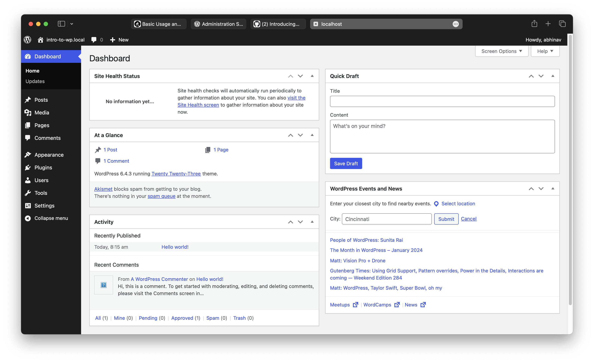
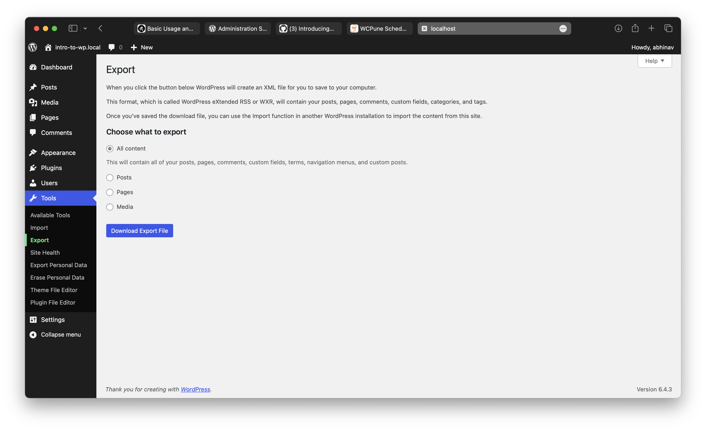
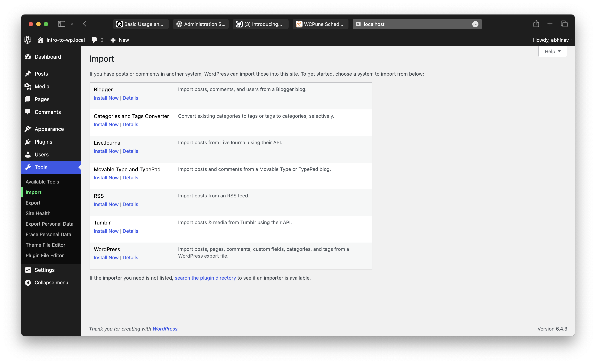

# What are the default widgets that you can see on the dashboard?

1. **At a glance**: Displays statistics about the site, like posts, comments count
2. **Activity**: Recent event's happened on the site, like post activity etc.
3. **Quick Draft**: Drafting ideas quickly via dashboard, rather than going to post editor
4. **WordPress News & Events**: This sections contains the 

# Is it possible to rearrange dashboard widgets? How can we achieve it?
**Yes.** It's possible, just drag and drop the widgets.
In order to move them up / down use the arrow at the top right in the widget.

# How can we export and import content in WordPress?

## Export Content

1. Go to `Tools > Export` in the left navigation bar.
2. Select the option which you need, then click on `Dowload Export File`.

## Import Content

1. Go to `Tools > Import`
2. Choose **importer** & install
3. Upload the `xml` file

# Can pages have parent-child relations?
In WordPress, pages can have parent-child relations. When creating or editing a page, you have the option to select a parent page, which establishes a hierarchical relationship between the pages. Child pages will be displayed as sub-pages in menus or navigation structures.

# What could be the URL structure of the child page?
The URL structure of a child page in WordPress typically includes the parent page's slug followed by the child page's slug, separated by slashes. For example:
```
Parent Page: example.com/parent-page/
Child Page: example.com/parent-page/child-page/
```

# What are Categories and Tags?
1. In WordPress, categories and tags are taxonomies used to organize and classify posts.
2. Categories are hierarchical taxonomies that can be organized into parent and child categories. They provide a way to group related posts under broad topics or themes.
3. Tags are non-hierarchical taxonomies that provide a way to add keywords or descriptive terms to posts. They are typically used for more granular classification and organization of content.

# How are Categories and Tags different?
1. Categories are hierarchical, allowing for parent-child relationships, while tags are non-hierarchical.
2. Categories are typically used for broad classification of content, while tags are used for more specific keywords or terms.
3. Categories are usually displayed in a hierarchical manner in WordPress themes, while tags are typically displayed as a flat list.