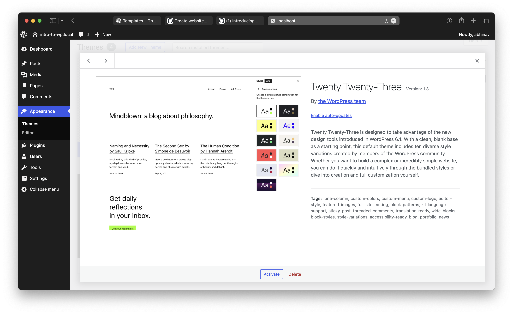
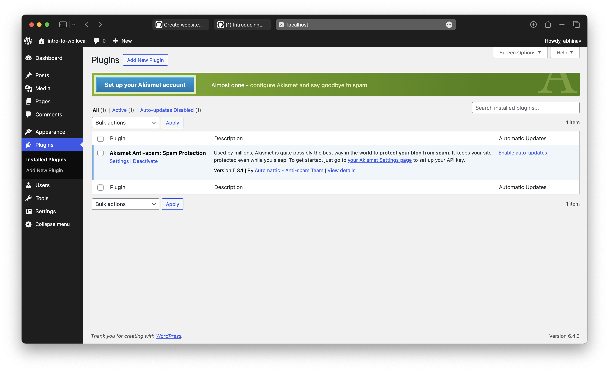

# Can we enable/disable auto-updates of themes and plugins?

## enable/disable auto-updates for themes

1. Go to `Appearance > Themes`, select the theme for which you want to apply the opeartion
2. Click on `Enable auto-updates` / `Disable auto-updates`


1. Go to `Plugins > Installed Plugins`, select the theme for which you want to apply the opeartion
2. Then in the table click on `Enable auto-updates` / `Disable auto-updates`

# What are the main directories in the WordPress installation?
```bash
.
├── wp-admin
├── wp-content
└── wp-includes

```

The main directories in a WordPress installation include:
- **wp-admin**: Contains files related to the WordPress admin dashboard.
- **wp-content**: Contains files related to themes, plugins, uploads, and other user-generated content.
- **wp-includes**: Contains core WordPress files and libraries.


# What is 'Menu Display Location'?
In WordPress, a "Menu Display Location" refers to the specific location within a theme where a navigation menu is displayed. Themes may define multiple menu locations, such as "Primary Menu," "Footer Menu," or "Header Menu," allowing users to assign different menus to different areas of their website.

# Can we install more than one theme in WordPress? How many themes can be 'active' at the same time?
1. **Yes**, we can install more than one theme in WordPress.
2. Only **one** theme can be active at the same time.

# What is the Customizer in WordPress?
The Customizer in WordPress is a built-in tool that allows users to customize various aspects of their website's appearance and settings in real-time. It provides a user-friendly interface for making changes to site identity, colors, backgrounds, menus, widgets, and more.

# What are the default customizer settings available?
Customizer setting vary depending upon themes, here are some common settings

- **Site Identity**: Site title, tagline, and logo.
- **Colors**: Changing the color scheme of your theme.
- **Menus**: Managing and assigning menus to different locations.
- **Widgets**: Adding and customizing widgets for sidebars and other areas.
- **Homepage Settings**: Configuring your homepage layout and content.
