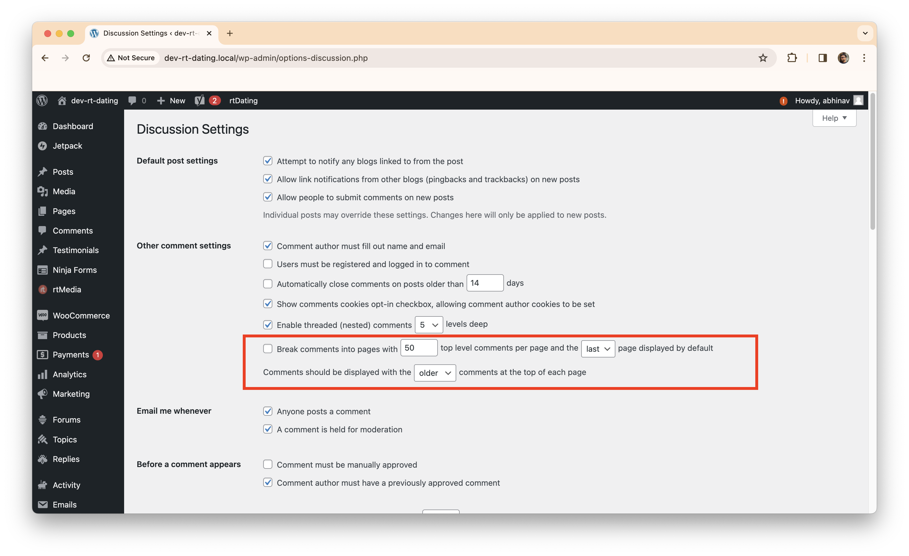
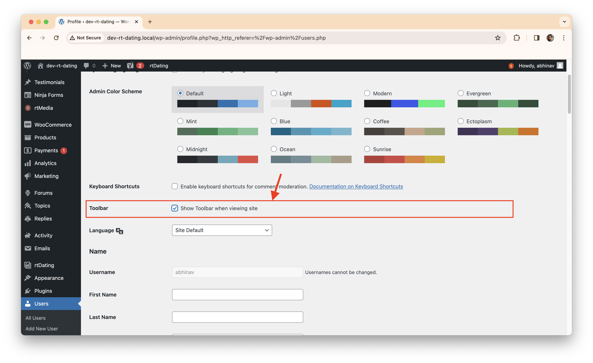

# In which directory is the media stored?
In WordPress, media files such as images, videos, and audio are stored in the `wp-content/uploads` directory by default. You can find this directory within your WordPress installation directory.

# When you upload a new media, what does the media URL look like?
1. The media URL for an uploaded file in WordPress typically follows the format: 
`https://yourdomain.com/wp-content/uploads/year/month/filename.ext` . 

For example: `https://example.com/wp-content/uploads/2024/02/image.jpg`.

# What are the possible comment statuses?
In WordPress, the possible comment statuses include:
* **Approved**: The comment has been approved and is visible on the site.
* **Pending**: The comment is awaiting moderation by an administrator.
* **Spam**: The comment has been marked as spam.
* **Trash**: The comment has been moved to the trash.

# How to change the number of comments per page (in the admin dashboard)?

* To change the number of comments per page in the WordPress admin dashboard, follow these steps:
    - Go to the "Settings" > "Discussion" page in the WordPress admin dashboard.
    - Look for the "Other comment settings" section.
    - Adjust the value in the "Break comments into pages" field to change the number of comments per page.

# What are the capabilities of distinct roles?
WordPress defines several distinct user roles, each with its own set of capabilities. Common roles include:
- `Administrator`: Has full access to all site features and settings.
- `Editor`: Can publish, edit, and delete posts and pages, as well as moderate comments.
- `Author`: Can publish and manage their own posts.
- `Contributor`: Can write and manage their own posts but cannot publish them.
- `Subscriber`: Can only manage their own profile.

# How can I disable the admin toolbar for a specific user?

* In order to disable toolbar for specific user
1. Go to `Users > All Users`
2. Click on the user for which you want to disable the toolbar
3. Scroll down to the `toolbar` section, and **untick** the checkbox.

# How many ways are there to add blocks?
* In WordPress, there are several ways to add blocks to your content:
    * **Gutenberg Editor**: Use the block editor in WordPress to add blocks directly to your posts and pages.
    * **Block Patterns**: Select from predefined block layouts called block patterns to quickly add complex designs to your content.
    * **Custom Templates**: Create custom templates that include predefined blocks and layout structures for specific types of content.
    * **Plugins**: Install plugins that provide additional blocks and block-based functionality for your site.