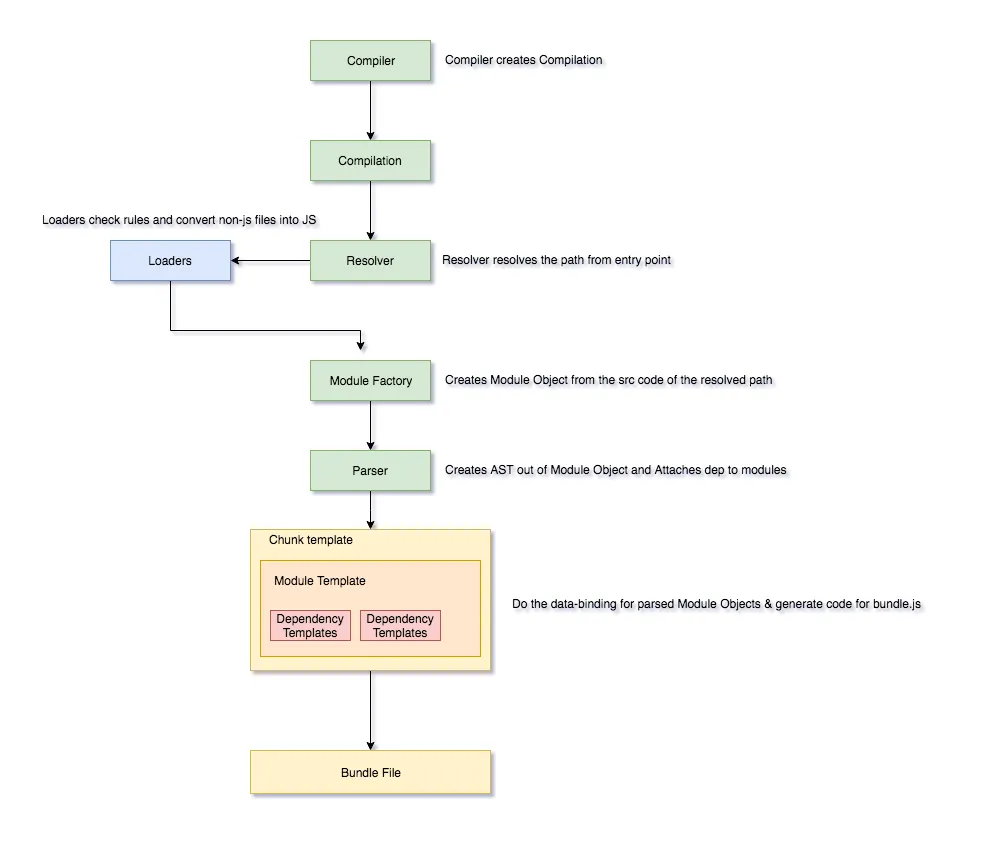
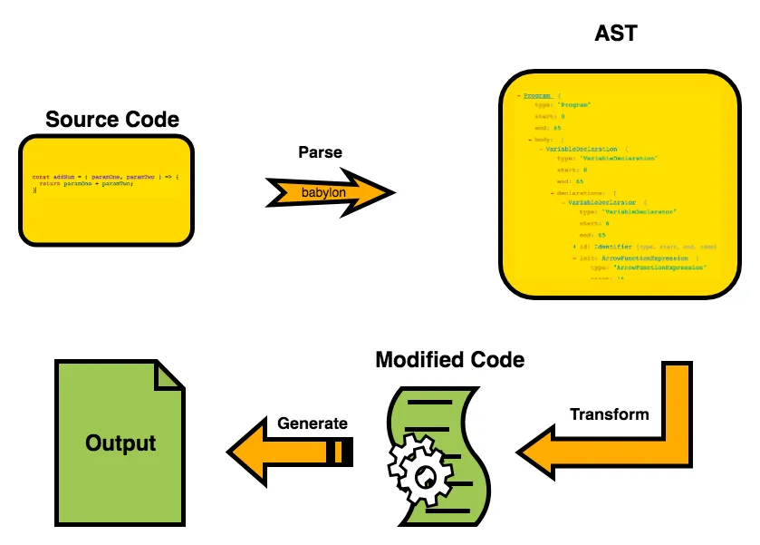

# Advance Theme Development : 9th April 2024 #154

## 1. What is Webpack? How does it work? How to set it up?
1. Webpack is a **static module bundler** for modern javascript.
2. When webpack processes the your application, it builds a dependancy graph from one or more entry points, and combines them into one ore more bundles. 

### Working




1. The compiler is the starting point, controls how the webpack starts/stops or emits.
2. The compiler then creates Compilation. Compilation is the heart of Webpack, where webpack kicks off building the graph, ceiling it and rendering it into bundles.
3. Resolver — When you pass your entry point to webpack , it gives it to the Resolver, which checks if a given partial path exits, and return the full absolute path along with extra info like context, request, calls etc. 
4. Module factories then take a successfully resolved request from the resolver, collects the source code from that file and create a module object/instance
5. A parser takes a string of source code and converts it into AST( Abstract Syntax Tree ) Webpack traverses through entire AST. It also finds all the require and import from AST statements and creates a dependency graph.
6. Templates will then do the data binding for your parsed module objects and generate the code that you see in the bundled javascript file. 
7. Tree shaking or Live Code inclusion means that webpack uses the syntax statically to identify, what is being used and bundles only that.

### Setting up

1. Create a node project with the command `npm init -y`
2. Add file named `webpack.config.js`
3. Add the entry points, loaders & plugins, along with the output directory.
4. For all the required loaders and plugins install the packages using `npm i --save-dev {package-name}`
5. Add these two lines inside the `package.json` file
    ```json
    "scripts": {
        "start" : "webpack-dev-server",
        "build" : "NODE_ENV='production' webpack",
        ...
        ...
    ```
6. To run use command `npm run start` or if you want to build the bundle use `npm run build` command.

**Example**
In the below example file, we are having
    - Entry Point as `./app/index.js`
    - Loaders like `svg-inline-loader`, `css-loader`
    - The output should be stored in `./dist` directory
    - And I want the bundle.js file to be added in the index.html file automatically at build
    - And I also want the webpack to dynamically change build based on environment.

    ```js
    const path = require( "path" );
    const HtmlWebpackPlugin = require('html-webpack-plugin');

    module.exports = {
        entry: "./app/index.js",
        module: {
            rules: [
                // Loading CSS
                {
                    test: /\.css$/i,
                    // They are loaded from right to left, so first the `css-loader` will be loader
                    use: ["style-loader", "css-loader"],
                },
                // Loading JS
                {
                    test: /\.(js)$/i,
                    use: "babel-loader"
                }
            ]
        },
        output: {
            path: path.resolve( __dirname, "dist" ),
            filename: "bundle.js"
        },
        plugins: [
            new HtmlWebpackPlugin()
        ],
        mode: process.env.NODE_ENV === "production" ? "production" : "development"
    };
    ```

## 2. What are loaders and plugins in the context of Webpack? What's their purpose? List and explain some of them.
### Loaders
1.  Loaders allow webpack to process other types of files and convert them into valid modules that can be consumed by your application and added to the dependency graph.
2. At a high level, loaders have two properties in your webpack configuration:
    - The `test` property identifies which file or files should be transformed.
    - The `use` property indicates which loader should be used to do the transforming.

    ```js
    const path = require('path');

    module.exports = {
    output: {
        filename: 'my-first-webpack.bundle.js',
    },
    module: {
        rules: [{ test: /\.txt$/, use: 'raw-loader' }],
    },
    };
    ```
### Plugins
1. Plugins can be leveraged to perform a wider range of tasks like bundle optimization, asset management and injection of environment variables.
    ```js
    const HtmlWebpackPlugin = require('html-webpack-plugin');
    const webpack = require('webpack'); //to access built-in plugins

    module.exports = {
    module: {
        rules: [{ test: /\.txt$/, use: 'raw-loader' }],
    },
    plugins: [new HtmlWebpackPlugin({ template: './src/index.html' })],
    };
    ```

### Examples Of Loaders and Plugins
Type | Example
--- | ---
Loaders | `svg-inline-loader`, `css-loader`, `file-loader`, `url-loader`, `image-webpack-loader`
Plugins | `clean-webpack-plugin`, `html-webpack-plugin`, `webpack-bundle-analyzer`, `webpack-dev-server`

## 3. What is Babel? How does it work? How to set it up?
Babel is a JavaScript **compiler**. Babel transpiles/converts modern JavaScript ( ECMAScript 2015+ ) code into a *backward compatible version of JavaScript* in current and older browsers or environments.

### Working

1. Babel runs in 3 stages
    - Parsing
    - Transform
    - Printing
2. Basically, for babel to do anything you need to add plugin else it will basically parse that and write the same code.
3. Babel is built on plugins which translates the moder js into an AST, and rewrites into backword compatible versions of JS.
    - The plugins are small JS programs.

### Setting Up
1. Create a node project with the command `npm init -y`
2. Add file named `babel.config.js` or `.babelsrc`

**Example**

If you create a `babel.config.js` then
```js
{
  "presets": ["@babel/preset-env"]
}
```

Else if you create `.babelsrc` then
```js
{
  "presets": [
 [
   "@babel/preset-env",
   {
  "targets": {
    "browsers": [ "last 2 versions" ]
  },
  // Madule: false means Hey babel don't do anything with the module let babel handle it.
  "modules": false
   }
 ]
  ]
  "plugins": []
}
```
3. Add the following to "scripts" in `package.json`
```json
"start": "babel src --out-dir lib && node lib/index.js",
```

## 4. What are "Presets" in babel? Explain in detail with examples.
1. Instead of adding all the plugins we want one by one, we can use a “preset” which is just a pre-determined set of plugins.
2. Common ones are:
    - @babel/preset-env
    - @babel/preset-flow
    - @babel/preset-react ( for React and it supports JSX Syntax )
    - @babel/preset-typescript

Let's say you want to use some of the latest ECMAScript features, but your target browsers don't support them natively. You can use Babel presets to transpile your modern JavaScript code into a backward-compatible version.

#### Example: @babel/preset-env
Without any configuration, this preset will include all plugins to support modern JavaScript (ES2015, ES2016, etc.)

## 5. What is a polyfill? Explain in detail with examples.
1. Since Babel assumes that your code will run in an ES5 environment it uses ES5 functions.
2. So if you’re using an environment that has limited or no support for ES5 such as lower versions of IE then using @babel/polyfill will add support for these methods. 


#### Example:
Let's say you want to use the Array.prototype.includes() method, which is not supported in Internet Explorer 11 (IE11). You can use a polyfill to add support for this method in IE11.

```js
// Polyfill for Array.prototype.includes()
if (!Array.prototype.includes) {
  Array.prototype.includes = function(searchElement, fromIndex) {
    // Polyfill implementation here
  };
}
```

This polyfill checks if the includes() method is available in the Array.prototype. If not, it defines the includes() method and provides its implementation.

## 6. Explain about 'Selective refresh' and how to achieve it.
1. Selective refresh is a technique used in WordPress theme development to update specific parts of a web page dynamically without refreshing the entire page.
2. Selective refresh works by targeting specific elements, such as widgets, within a web page and updating their content via AJAX requests.

### How to achive it ?
1. Adding support for customize-selective-refresh-widgets feature when registering theme support.
    ```php
    add_theme_support( 'customize-selective-refresh-widgets' );
    ```
2. Next, register partials for the elements you want to refresh selectively. Partial is a PHP class that defines how a specific element should be rendered and refreshed.
    ```php
    function mytheme_customize_register( $wp_customize ) {
        $wp_customize->selective_refresh->add_partial( 'sidebar', array(
            'selector' => '.widget-area',
            'render_callback' => 'mytheme_render_sidebar',
        ) );
    }
    add_action( 'customize_register', 'mytheme_customize_register' );

    function mytheme_render_sidebar() {
        // Render sidebar content here
    }
    ```
3. Trigger Refresh: When a change occurs in the customizer, trigger selective refresh for the registered partials to update their content dynamically.
    ```php
    wp.customize.selectiveRefresh.bind( 'partial-content-rendered', function( placement ) {
        // Update content after partial is rendered
    } );
    ```
4. Handle Refresh: Finally, handle the refresh request on the server-side by defining the render callback function specified in the partial registration.
    ```php
    function mytheme_render_sidebar() {
        dynamic_sidebar( 'sidebar' );
    }
    ```